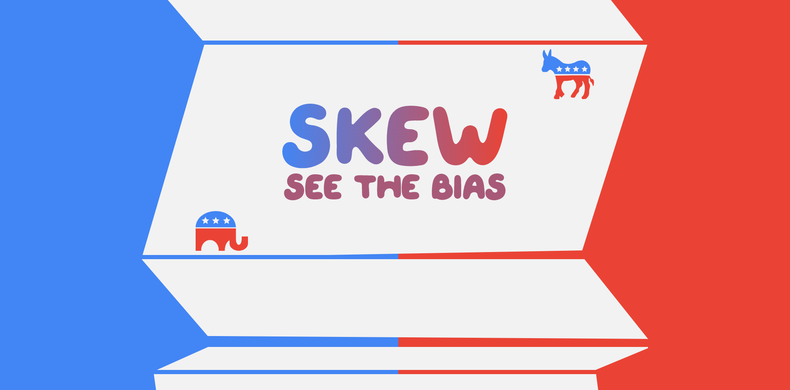

# Skew: See the Bias
A Chome extension that lets you easily see political bias.

## INSPIRATION
After watching the presidential “debate”/yelling match, there was a slew of tweets and articles dissecting what went on. It was tiring to read articles where writers clearly had a political bias. It did make our team think, “with the articles that we did read through, was it because the author had a political bias that matched ours?” It’s nice to think that we’re impartial consumers but, that’s folly. Technology/algorithms learn our political preferences and show us content that pleases us. We wanted a simple, easy-to-use extension that showed us political bias in the articles we read.

## WHAT IT DOES
Skew is a chrome extension that lets people see the “skew”/political bias using a sliding scale.

After navigating to an article, users can click on the Skew chrome extension. Skew then parses the article and uses Google Cloud’s Natural Processing API to find biased wording. It categorizes those words as either “right”, “left”, or “neutral” then shows the extent either “minimal”, “moderate”, “strong”, or “extreme”. It returns the analysis to the user.

## HOW WE BUILT IT
**Chrome Extension**
/// Alex + Bisman you should probably write/edit this one.

**Website**
First, Devonne created a logo on Adobe Illustrator. Then she made a mockup using AdobeXD. Using HTML, CSS, and JQuery she brought it to life. Juan made the skewed rectangles animate as the user scrolled.

## CHALLENGES WE RAN INTO
**Finding a Dataset**
We had a difficult time finding a dataset that gives us news articles and perceived political bias. Google Cloud’s Natural Processing API is amazing but, out-of-box features like “sentiment analysis” and “entity level sentiment” were a little too broad. Political bias is subtle so it was paramount to find a specific dataset to train our model on. We solved it by asking for help. A mentor dropped a link to a dataset entitled “Quantifying News Media Bias through Crowdsourcing and Machine Learning”. It was perfect!

**Mock Backend**
I don’t know if I remember the issue correctly. Alex?
Using OpenAPI our fantastic backend developer created a mock backend. There was a huge issue in the beginning. It did not work. After 6 hours of Googling and debugging, he finally realized - he didn’t include the correct package.

**Animating the Webpage**
Juan?

**Changing Text Color Based on Mouse Position**
The goal was for the “See the Bias” tagline to change color based on whether or not the user was on the right side or the left side of the screen. It took 3 tries from 2 different people but, eventually, Devonne caved and copy/pasted an inefficient solution off of StackOverflow that uses bilinear interpolation.

## ACCOMPLISHMENTS WE’RE PROUD OF
We created a chrome extension! A finished product is always something to be proud of. It takes work to successfully train a model to distinguish something so subtle as political bias. Taking that model and using it to help users see political bias is something we’re super proud of.

Not only that, but we created a product webpage. That way users can understand what skew is and be inclined to use it.

## WHAT WE LEARNED
Devonne learned that AdobeXD allows you to copy the SVG code directly from the software. Previously, she marked assets for export then used the development link to grab those assets. Bypassing the extra step gives her 10% more time to develop. Also, she learned how to edit SVG code - using a text editor. Instead of backtracking to a vector editor when there’s a tiny error, she can now manipulate the code directly.

Alex, Bisman, Juan - add whatever you learned

## WHAT’S NEXT FOR SKEW?
We would love to publish the chrome extension on the Google Chrome Extension Store!

> Submission for IvyHacks 2020 - Social Good Track + Best Use of Google Cloud
